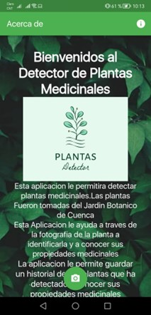

# Plant Disease Detector
Una aplicación Flutter que detecta la planta a partir de una foto de la planta.
## Visuals


## Instalacion

Se requiere una instalación de Flutter para ejecutar este proyecto.
Para instalar Flutter, visita la instalación oficial [documentation](https://docs.flutter.dev/get-started/install).
Configure un editor de elección como se especifica [here](https://docs.flutter.dev/get-started/editor).

Descarga el proyecto.

```bash
git clone https://github.com/CarlosAndrade2636/Clasificacion-Plants.git
```

Ejecute el siguiente comando dentro del directorio del proyecto para instalar los paquetes necesarios.
```bash
flutter pub get
```
Para ejecutar el proyecto en modo de depuración 
```bash
flutter run
```

Para generar una versión de lanzamiento
```bash
flutter build apk
```
Localiza el `app-release.apk` archivo del directorio `build/app/outputs/flutter-apk/` e instálelo en su teléfono inteligente Android o emulador para usar.

## Uso

Al iniciar la aplicación, se le presentarán las instrucciones de uso. De ello se deduce que para obtener una sugerencia de una planta de interés, tome una foto de la planta o seleccione una foto de la planta de su `gallery`.

Luego, la aplicación ejecuta el modelo TFLITE en segundo plano para obtener una sugerencia de la planta.
Muestra los resultados en la siguiente pantalla. `Suggestions`

## Importante tener en cuenta
- El modelo `tflite` ha sido entrenado para detectar sólo un subconjunto de plantas. Incluyen:

    ['Begonia peltatifolia', 'Borraja', 'Calahuala', 'Carne Humana', 'Cedron', 'Chulco', 'Fuchsia', 'Hierba Luisa', 'Hinojo', 'Iresine', 'Lavanda', 'Limon', 'Llanten', 'Manzanilla', 'Moradilla', 'Ñachic', 'Oreja de Burro', 'Ortiga', 'Pena Pena', 'Romero', 'Ruda', 'Sangoracha', 'Tigresillo', 'Toronjil', 'Violeta']

- El tamaño del conjunto de datos solo fue suficiente para que el modelo reconociera plantas seleccionadas, pero enfrenta problemas con las imágenes de plantas que no son.
- La aplicación fue construida usando Flutter y un modelo  `tflite` de [Teachable Machine Learning by Google](https://teachablemachine.withgoogle.com/). El conjunto de datos era de [GOOGLE DRIVE](https://drive.google.com/drive/folders/13xQSUwbAqtTv-opgwD8XcgO5vJsugQP2).

## Contribuyendo
Contributions towards the project are welcome.
Specifically:

- El modelo `tflite` utilizado puede ser reemplazado por uno más preciso uno con más plantas.
- La capacidad de respuesta de la aplicación se puede mejorar..
- Se pueden agregar mensajes de advertencia para entradas ajenas a la planta realizadas por los usuarios.

## Estado del proyecto
Los requisitos que establecí han sido posibles. Sin embargo, la aplicación aún se puede mejorar.
Se pueden hacer adiciones/mejoras como se especifica en la seccion `Contributing`.

